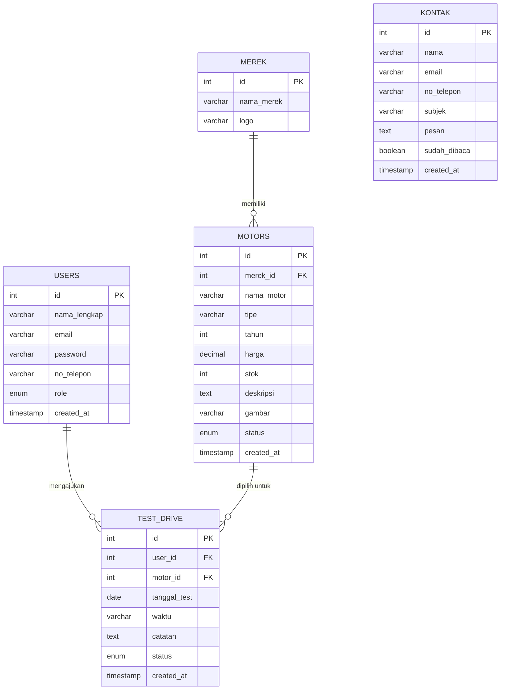

# 🗄️ Database Schema — Website Showroom Sepeda Motor

> Dokumen ini menjelaskan struktur tabel database MySQL untuk website showroom sepeda motor.
> Framework: **CodeIgniter 4**
> Dibuat oleh: Backend Developer

---

## 📊 ERD (Entity Relationship Diagram)



---

## 📋 Detail Tabel

### 1. Tabel `users`
Menyimpan data akun pengguna (calon pembeli) dan admin.

| Kolom | Tipe Data | Constraint | Keterangan |
|---|---|---|---|
| id | INT | PK, AUTO_INCREMENT | ID unik pengguna |
| nama_lengkap | VARCHAR(100) | NOT NULL | Nama lengkap pengguna |
| email | VARCHAR(100) | NOT NULL, UNIQUE | Alamat email untuk login |
| password | VARCHAR(255) | NOT NULL | Password (di-hash dengan bcrypt) |
| no_telepon | VARCHAR(15) | NULLABLE | Nomor HP pengguna |
| role | ENUM | DEFAULT 'user' | Nilai: `user`, `admin` |
| created_at | TIMESTAMP | DEFAULT NOW() | Waktu akun dibuat |

---

### 2. Tabel `merek`
Menyimpan data merek/brand sepeda motor.

| Kolom | Tipe Data | Constraint | Keterangan |
|---|---|---|---|
| id | INT | PK, AUTO_INCREMENT | ID unik merek |
| nama_merek | VARCHAR(50) | NOT NULL, UNIQUE | Nama merek (Honda, Yamaha, Suzuki, dll) |
| logo | VARCHAR(255) | NULLABLE | Path file logo merek |

**Data awal (seed):**
- Honda
- Yamaha
- Suzuki
- Kawasaki
- TVS

---

### 3. Tabel `motors`
Tabel inti — menyimpan data semua motor di showroom.

| Kolom | Tipe Data | Constraint | Keterangan |
|---|---|---|---|
| id | INT | PK, AUTO_INCREMENT | ID unik motor |
| merek_id | INT | FK → merek.id, NOT NULL | Merek motor |
| nama_motor | VARCHAR(150) | NOT NULL | Nama lengkap motor (mis: "Honda Vario 160") |
| tipe | VARCHAR(50) | NOT NULL | Tipe: `matic`, `sport`, `bebek` |
| tahun | YEAR | NOT NULL | Tahun produksi |
| harga | DECIMAL(15,2) | NOT NULL | Harga motor dalam Rupiah |
| stok | INT | DEFAULT 0 | Jumlah unit tersedia |
| deskripsi | TEXT | NULLABLE | Deskripsi & spesifikasi motor |
| gambar | VARCHAR(255) | NULLABLE | Path file foto motor |
| status | ENUM | DEFAULT 'tersedia' | Nilai: `tersedia`, `habis`, `indent` |
| created_at | TIMESTAMP | DEFAULT NOW() | Waktu data motor ditambahkan |

---

### 4. Tabel `test_drive`
Menyimpan pengajuan test drive dari calon pembeli.

| Kolom | Tipe Data | Constraint | Keterangan |
|---|---|---|---|
| id | INT | PK, AUTO_INCREMENT | ID unik pengajuan |
| user_id | INT | FK → users.id, NOT NULL | Pengguna yang mengajukan |
| motor_id | INT | FK → motors.id, NOT NULL | Motor yang ingin di-test drive |
| tanggal_test | DATE | NOT NULL | Tanggal test drive yang diinginkan |
| waktu | VARCHAR(10) | NOT NULL | Waktu: `pagi`, `siang`, `sore` |
| catatan | TEXT | NULLABLE | Catatan tambahan dari pelanggan |
| status | ENUM | DEFAULT 'menunggu' | Nilai: `menunggu`, `disetujui`, `ditolak`, `selesai` |
| created_at | TIMESTAMP | DEFAULT NOW() | Waktu pengajuan dibuat |

---

### 5. Tabel `kontak`
Menyimpan pesan masuk dari form kontak website.

| Kolom | Tipe Data | Constraint | Keterangan |
|---|---|---|---|
| id | INT | PK, AUTO_INCREMENT | ID unik pesan |
| nama | VARCHAR(100) | NOT NULL | Nama pengirim |
| email | VARCHAR(100) | NOT NULL | Email pengirim |
| no_telepon | VARCHAR(15) | NULLABLE | Nomor HP pengirim |
| subjek | VARCHAR(200) | NOT NULL | Subjek pesan |
| pesan | TEXT | NOT NULL | Isi pesan |
| sudah_dibaca | BOOLEAN | DEFAULT FALSE | Status baca admin |
| created_at | TIMESTAMP | DEFAULT NOW() | Waktu pesan dikirim |

---

## 🔗 Ringkasan Relasi Antar Tabel

| Relasi | Tipe | Keterangan |
|---|---|---|
| merek → motors | One-to-Many | Satu merek punya banyak model motor |
| users → test_drive | One-to-Many | Satu user bisa ajukan banyak test drive |
| motors → test_drive | One-to-Many | Satu motor bisa dipilih di banyak pengajuan |

---

## ⚙️ SQL Migration (CI4 Format)

File migrasi disimpan di `app/Database/Migrations/`

```sql
-- Tabel merek
CREATE TABLE merek (
    id INT AUTO_INCREMENT PRIMARY KEY,
    nama_merek VARCHAR(50) NOT NULL UNIQUE,
    logo VARCHAR(255)
);

-- Tabel motors
CREATE TABLE motors (
    id INT AUTO_INCREMENT PRIMARY KEY,
    merek_id INT NOT NULL,
    nama_motor VARCHAR(150) NOT NULL,
    tipe VARCHAR(50) NOT NULL,
    tahun YEAR NOT NULL,
    harga DECIMAL(15,2) NOT NULL,
    stok INT DEFAULT 0,
    deskripsi TEXT,
    gambar VARCHAR(255),
    status ENUM('tersedia','habis','indent') DEFAULT 'tersedia',
    created_at TIMESTAMP DEFAULT CURRENT_TIMESTAMP,
    FOREIGN KEY (merek_id) REFERENCES merek(id)
);

-- Tabel users
CREATE TABLE users (
    id INT AUTO_INCREMENT PRIMARY KEY,
    nama_lengkap VARCHAR(100) NOT NULL,
    email VARCHAR(100) NOT NULL UNIQUE,
    password VARCHAR(255) NOT NULL,
    no_telepon VARCHAR(15),
    role ENUM('user','admin') DEFAULT 'user',
    created_at TIMESTAMP DEFAULT CURRENT_TIMESTAMP
);

-- Tabel test_drive
CREATE TABLE test_drive (
    id INT AUTO_INCREMENT PRIMARY KEY,
    user_id INT NOT NULL,
    motor_id INT NOT NULL,
    tanggal_test DATE NOT NULL,
    waktu VARCHAR(10) NOT NULL,
    catatan TEXT,
    status ENUM('menunggu','disetujui','ditolak','selesai') DEFAULT 'menunggu',
    created_at TIMESTAMP DEFAULT CURRENT_TIMESTAMP,
    FOREIGN KEY (user_id) REFERENCES users(id),
    FOREIGN KEY (motor_id) REFERENCES motors(id)
);

-- Tabel kontak
CREATE TABLE kontak (
    id INT AUTO_INCREMENT PRIMARY KEY,
    nama VARCHAR(100) NOT NULL,
    email VARCHAR(100) NOT NULL,
    no_telepon VARCHAR(15),
    subjek VARCHAR(200) NOT NULL,
    pesan TEXT NOT NULL,
    sudah_dibaca BOOLEAN DEFAULT FALSE,
    created_at TIMESTAMP DEFAULT CURRENT_TIMESTAMP
);
```

---

## 📝 Catatan Implementasi CI4

- Gunakan **CI4 Migration** untuk membuat tabel: `php spark migrate`
- Gunakan **CI4 Seeder** untuk data awal merek: `php spark db:seed MerekSeeder`
- Hash password menggunakan `password_hash()` bawaan PHP sebelum disimpan
- Tambahkan **index** pada kolom `merek_id`, `tipe`, `status` di tabel `motors` untuk optimasi pencarian
